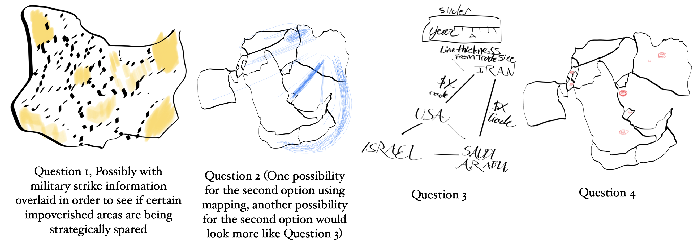

# Final Project Proposal

Over the past several days, the world has had its attention drawn to a rapidly growing conflict in the Middle East. Although the long term consequences of the growing war remain uncertain, the twists and turns this conflict has taken and which it continues to take have been unexpected.

For my final project, I propose to create a web-based application allowing users to examine the ongoing conflict in the Middle East. I have reached out to the Institute for National Security Studies (I.N.S.S.), an independent organization affiliated with The University of Tel Aviv, to ask after a copy of a dataset they are using for a visualization dashboard on their website. If I am unable to acquire a copy of their data, I will instead investigate the pre-conflict structuring of the region and Iran using Correlates of War data, World Development Indicators, and data from iranopendata.org.

I am particularly interested in looking at the areas of Iran which suffered particularly acutely beneath the reign of Ayatollah Khamenei, in what is effectively a comparative political economy analysis of the country, alongside a security analysis of the region as a whole. By combining foreign and domestic frames of analysis, I will be able to present a stronger and more interesting analysis both of what is already occurring in the Middle East and what is potentially going to occur over the coming weeks, and, perhaps, months.
My main focus areas are presented here in the form of questions, and are as follows:

1. What areas of Iran have suffered particularly greatly during the reign of the Ayatollahs? To answer this question, I intend to examine the misery index and poverty data across Iran, visualizing it in the form of a map.
- If I get access to the I.N.S.S. data, I would also like to examine which places in Iran are being targeted compared to the areas on this map.
2. How strong are Iran’s relationships with its surrounding countries? In order to analyze this question, I intend to look at reciprocal relations, map these relations into a score format, and present a graph analyzing the shift in these relations over time… OR a more complex visualization showing a map of relations between countries.
3. How tightly integrated are the countries opposing Iran? Are there clear economic ties in between them?
4. Where are the military bases in the region? What does their distribution look like. I realize that this is another mapping one, so I will try to make the various mapping preparations look different.

I intend to incorporate my findings as either a subdomain of or webpage on my personal website/blog, ideally in an interactive format. I have been preparing a number of sketches of what my visualizations could look like, and these sketches appear below, although they remain subject to change, especially if I am able to able to get a copy of the I.N.S.S. data.

Ideally, I will include an interactive component on the webpage, but I do have concerns about some technical challenges which I may face in causing this to come to fruition, so I don’t want to make any promises. I think that I will be able to make some pretty interesting visualizations of the data in Iran, even if I’m not able to get access to the latest strike data. One fifth option would be to create something like the first option, only creating some sort of proxy “rebellion-prone” score in order to predict which regions have both been A) systematically oppressed and B) involved in rounds of protest against the regime. There has already been some talk about C.I.A. arming the Kurds in northwestern Iran, so it would be particularly interesting to examine Kurdish areas in regard to rebelliousness given that Iran has had a much better relationship with its Kurdish population than many other Middle Eastern countries.